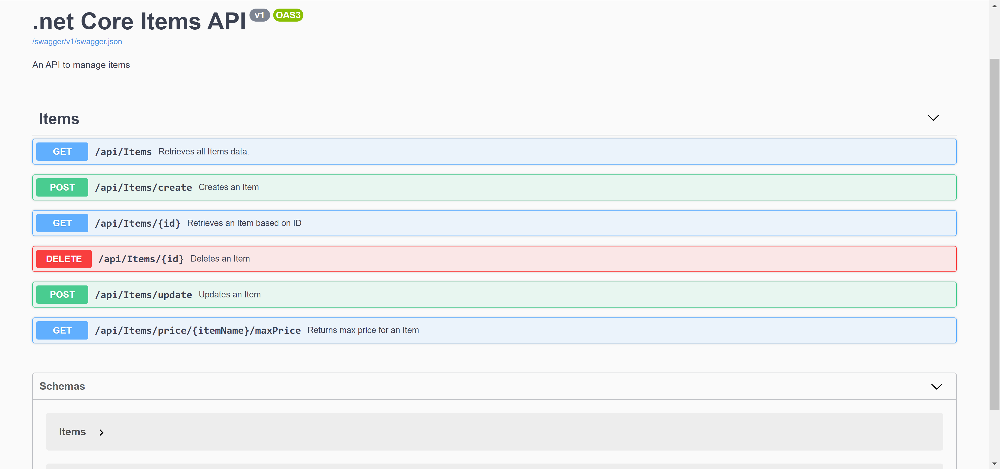
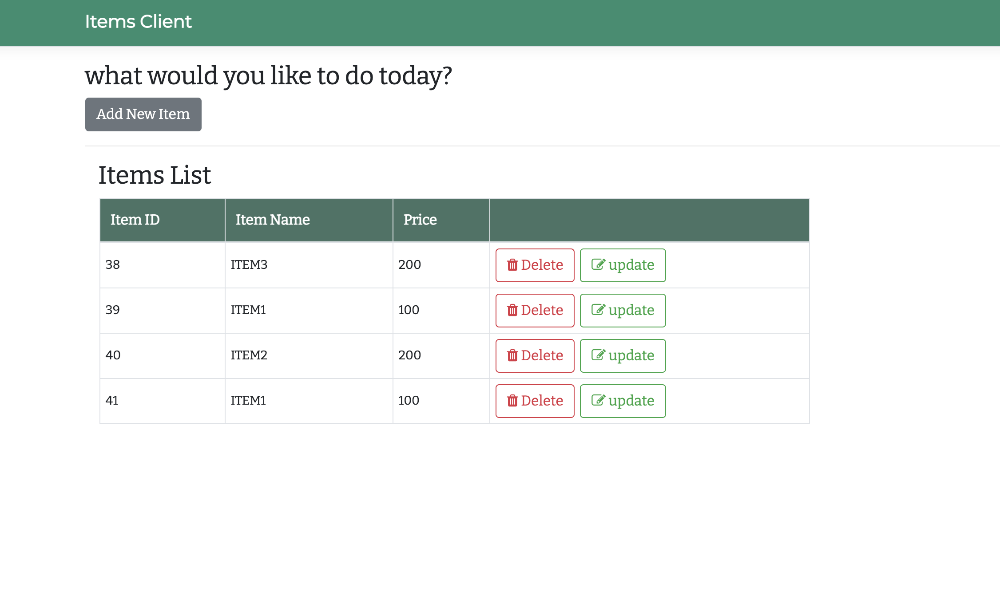
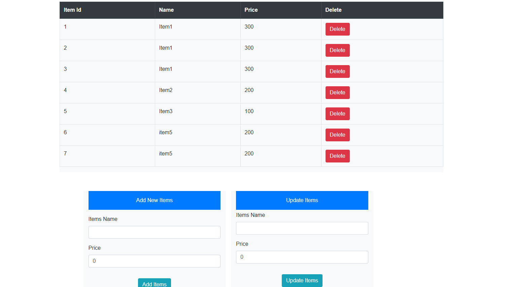

# .netcore-sqlite-items
My take on Items API (API to maintain Items) which lets the user do CRUD operations on the Items with .NET Core, Swagger, Fluent Validator, SQLite and unit test cases.
This repository contains 3 projects - Items API  lets you do basic CRUD operations and the Swagger URL is /swagger/ui and two Client consuming the API
1. MVC client also a single page with jQuery Ajax calls, JS Fetch API, DI for reusing httpclient.

API

MVC Client

Blazor Server Client

